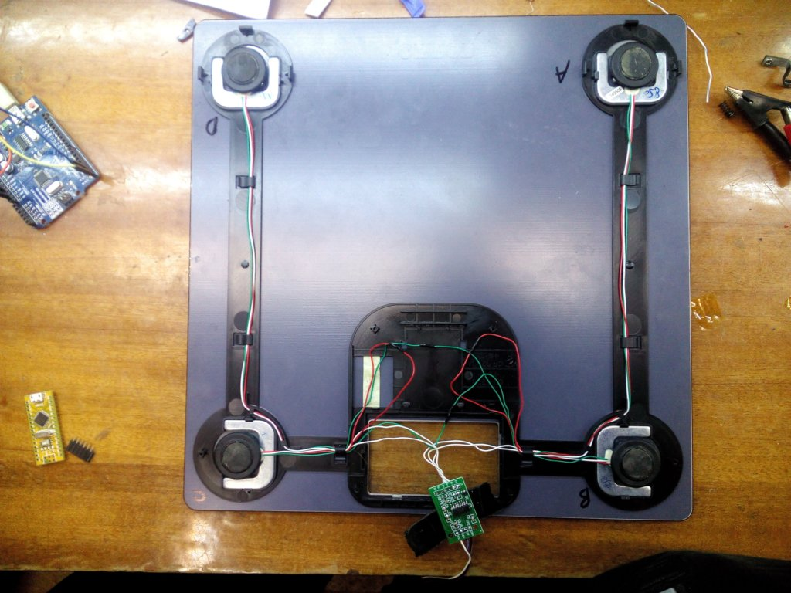
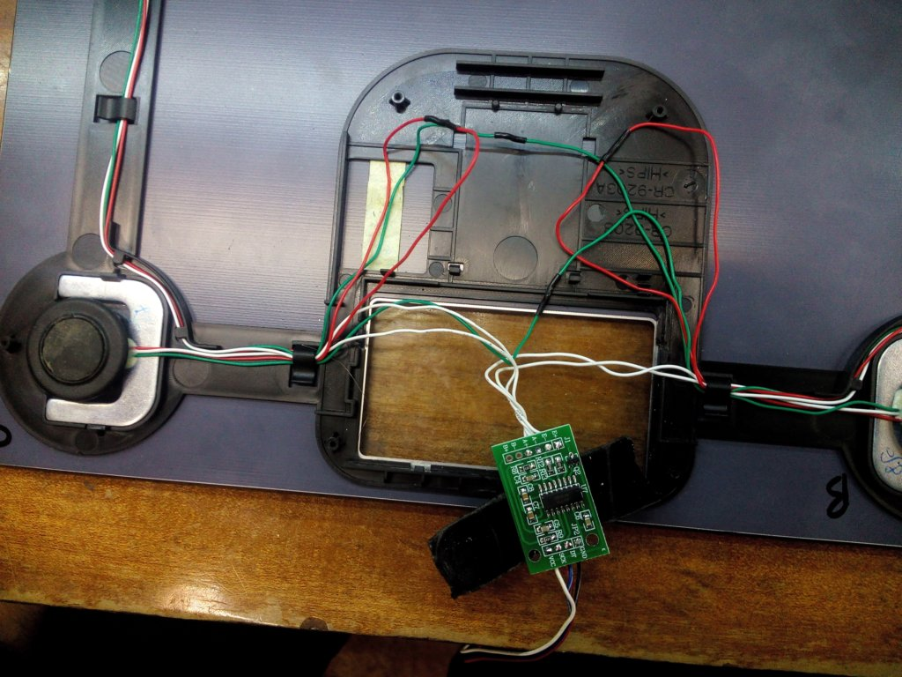
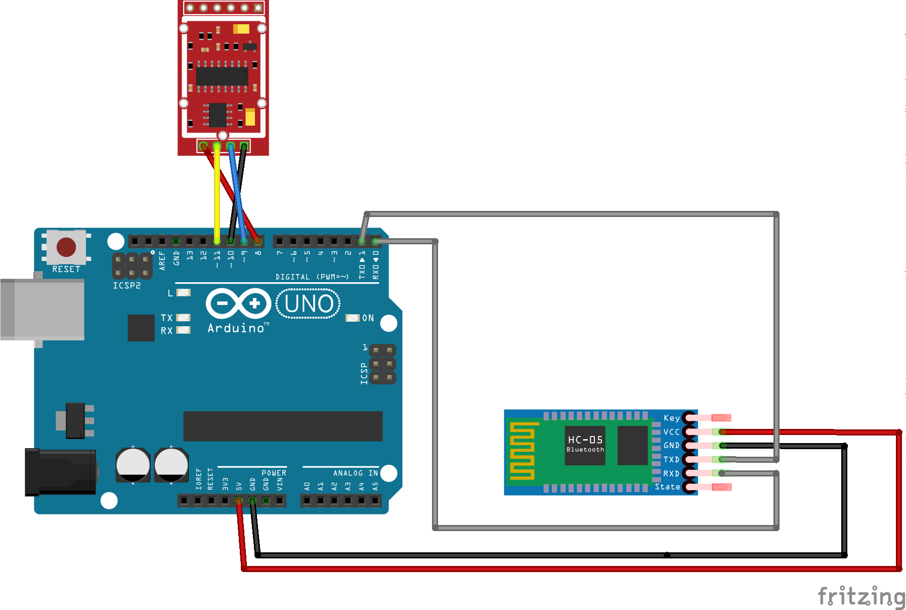
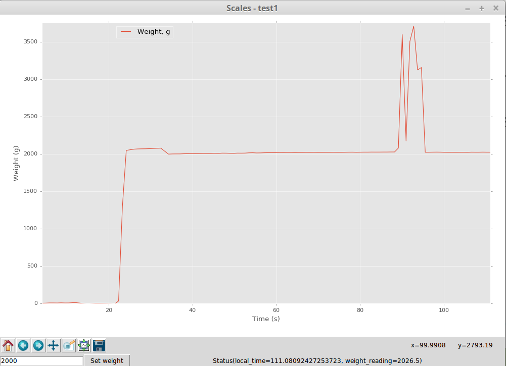

# Scale hack

## Rationale
Electornic scales could be bought online for several bucks, but any scales that could be connected to a computer is a lot more expensive. The idea of this project is to create a compact and cheap solution that could be used to hack any conventional consumer-grade scales to make them connected. 

## Solution

#### Hardware


 * [HX711](http://www.ebay.com/itm/HX711-Weighing-Sensor-Dual-Channel-24-Bit-Precision-A-D-Module-Pressure-Sensor-/161264280835) - a 24 bit delta-sigma ADC with integrated instrumentation amplifier is a chip specifically designed for digitizing strain-gauge bridges.
 * A goto solution for any quick and dirty hack - an Arduino clone sourced from ebay.
 * HC-05 Bluetooth dongle of the same origin

#### Build instructions


Open the scales and trace/buzz the wires of the strain gauges. Majority of them will be connected together, leaving just 4 wires which participate in measurement process. Of those two will be Excitation + and - wires, the other pair - Signal + and -. To distinguish whitch is whitch, measure voltage from gound to all of those 4 wires. The lowest voltage point will be Excitation-, highest - Excitation+, middle point - Signal + and -, it's not exactly clear which is which instantly, you can always just exchange them if your readings go negative.



Connect Excitation wires to E+ and E- of HX711 board, connect Signal wires to A+ and A- of HX711. Hook up VCC, GND, DT and SCK pins to pins 8, 9, 10, 11 of Arduino as shown in diagram below.

 

#### Software

 * Arduino library used: https://github.com/bogde/HX711
 * A simple serial protocol implemented - if 0 is sent, the scale is zeroed, if any non-zero number is sent, it is cansidered that equal weight object is placed on the scale and used to calibrate the upper range of the scale.
 
```Arduino
#include "HX711.h"

String content = "";

HX711 scale;

#define DOUT 9
#define SCK 11

void setup() {
  pinMode(10, OUTPUT);
  digitalWrite(10, LOW);
  pinMode(8, OUTPUT);
  digitalWrite(8, HIGH);
  
  Serial.begin(9600);
  scale.begin(DOUT, SCK);

  scale.set_scale(19.55);
  scale.tare();				        
}

void loop() {
  Serial.println(scale.get_units(10), 1);
  while(Serial.available()) {
    char c = Serial.read();
    if('\n' == c) {
      unsigned int n = content.toInt();
      content = String("");
      if(0 == n) {
        scale.tare();
      } else {
        scale.set_scale(1);
        double t = scale.get_units(10);
        double r = t/n;
        scale.set_scale(r);
      }
    } else {
      content.concat(c);
    }
  }
}
```

Host-side python code allows for data logging and visualisation. Add python modules until it works. 



### Cost analysis

Component | Cost 
----------|---------
HX711     | $0.99
Arduino Nano | $2.73
HC-05 | $0.76
**Total** | **$4.48**

